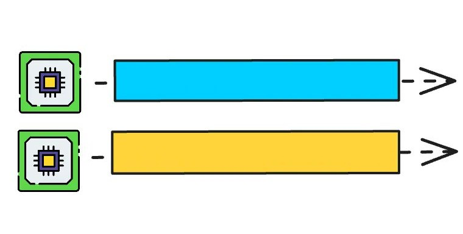
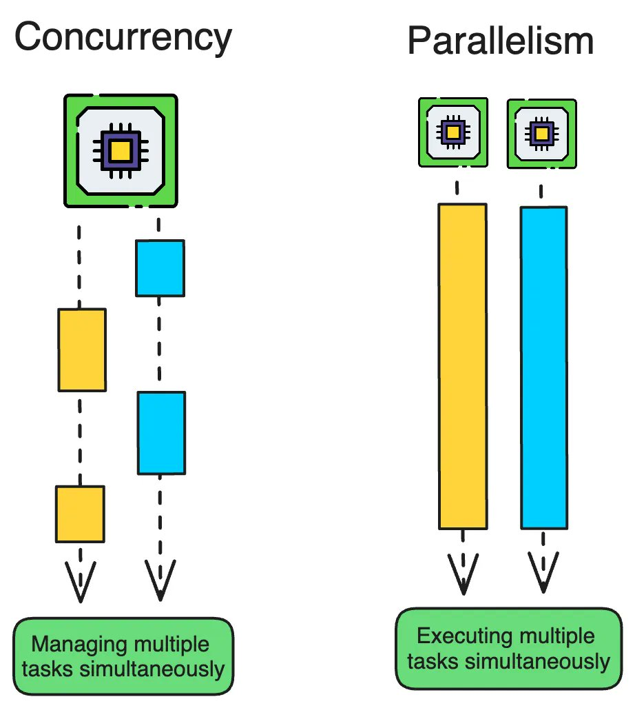
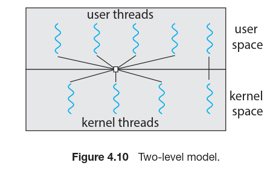
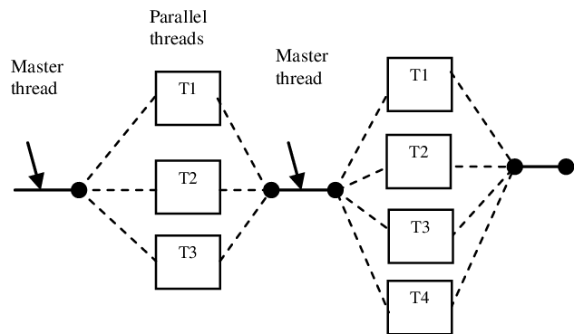

## Phase 1: The Foundation
### Thread 
A **process** is a running instance of a program. You can see them with
```sh
ps aux | wc -l
```
A process has its own:
- memory space
- resources
- file handles
- execution environment

A **thread** is a unit of execution inside a process.



Thread is a basic unit of CPU utilization; it comprises a thread ID, a program
counter (PC), a register set, and a stack.

### Concurrency vs Parallelism

### Scheduler Basics



## Phase 2: The Need
### Concurrency in Web Applications

- Multi user application
- What happens when a server is _not_ concurrent (blocking, low throughput, timeouts).

### The Types of Work: I/O Bound vs. CPU Bound
- **I/O Bound:** Waiting for a database, a file, or an API call. (This is where Go shines!)
- **CPU Bound:** Heavy calculation, image processing, or data compression.

In web development we have `I/O Bound` tasks.

## Phase 3: Writing the Code 

### Goroutines
Add a simple `go` and you have it
```go
func infiniteCount(thing string) {
    for i := 1; true; i++ {
        fmt.Println(i, thing)
        time.Sleep(time.Second * 1)
    }
}


func main() {
    infiniteCount("dog") // go infiniteCount("dog")
    infiniteCount("cat")
}
```


### The Fork-Join Model
Golang follow fork and join model like other programming language.

The “Fork”: Starting the goroutine. But this leaves two question.
1. How we join it?
2. What happens if we don't ?
The following code help us to clear things up.
```go
func count(thing string) {
    for i := 1; i <= 5; i++ {
        fmt.Println(i, thing)
        time.Sleep(time.Millisecond * 500)
    }
}


func main() {
    var wg sync.WaitGroup
    wg.Add(1)
    go func() {
        count("dog")
        wg.Done()
    }()
    wg.Wait()
}
```

## Phase 4: Pitfalls
### Data Races
Let's gust the output of this code. 
```go
func main() {
	var wg sync.WaitGroup
	
	counter := 0

	for i := 0; i < 1000; i++ {
		wg.Add(1)
		go func() {
			defer wg.Done()
			counter++
		}()
	}

	wg.Wait()
	fmt.Println("Counter:", counter)
}
```
Not 1000 ? can you predict the output ? This happens because thread want to access same data,
```
increment:
    mov eax, DWORD PTR [counter]    ; Step 1: Load counter into eax (READ)
    add eax, 1                       ; Step 2: Increment eax
    mov DWORD PTR [counter], eax    ; Step 3: Store eax back to counter (WRITE)
    ret
```

|Time|Thread 1|Thread 2|counter value|
|---|---|---|---|
|T1|`mov eax, [counter]` → eax=0||0|
|T2||`mov eax, [counter]` → eax=0|0|
|T3|`add eax, 1` → eax=1||0|
|T4||`add eax, 1` → eax=1|0|
|T5|`mov [counter], eax` → counter=1||1|
|T6||`mov [counter], eax` → counter=1|1|
```go
func main() {
	var (
		wg      sync.WaitGroup
		mu      sync.Mutex
		counter = 0
	)

	for i := 0; i < 1000; i++ {
		wg.Add(1)
		go func() {
			defer wg.Done()

			mu.Lock()
			counter++
			mu.Unlock()
		}()
	}

	wg.Wait()
	fmt.Println("Counter:", counter)
}
```

A **mutex** is a lock used to protect shared data. Only one goroutine can hold the lock at a time.
When you _must_ share memory (protecting critical sections).

## Phase 5:  All not about Mutex
### Deadlocks
A **deadlock** happens when goroutines are waiting for each other forever, so nothing can continue
```go
func main() {
	var (
		wg      sync.WaitGroup
		mu      sync.Mutex
		counter = 0
	)

	for i := 0; i < 1000; i++ {
		wg.Add(1)
		go func() {
			defer wg.Done()

			mu.Lock()
			counter++
		}()
	}

	wg.Wait()
	fmt.Println("Counter:", counter)
}
```
Rember it is not all about mistake. Deadlock can create by bad design too. 

### Data Communication: Channels
channel is just a thread safe queue.
```go
package main

import "fmt"

func main() {
	ch := make(chan string)

	go func() {
		ch <- "hello from goroutine" // send data into channel
	}()

	message := <-ch // receive data from channel
	fmt.Println(message)
}

```
You can check if a channel is close by this 
```go
package main

import "fmt"

func main() {
	ch := make(chan int)

	go func() {
		for i := 1; i <= 5; i++ {
			ch <- i
		}
		close(ch)
	}()

	for value := range ch {
		fmt.Println("received:", value)
	}
}
```

```go
package main

import (
	"fmt"
	"sync"
	"time"
)

func producer(ch chan<- int) {
	for i := 1; i <= 5; i++ {
		fmt.Println("producing", i)
		ch <- i
		time.Sleep(500 * time.Millisecond)
	}
	close(ch)
}

func consumer(ch <-chan int, wg *sync.WaitGroup) {
	defer wg.Done()

	for value := range ch {
		fmt.Println("consumed", value)
		time.Sleep(1 * time.Second)
	}
}

func main() {
	ch := make(chan int, 2)
	var wg sync.WaitGroup

	wg.Add(1)
	go consumer(ch, &wg)

	go producer(ch)

	wg.Wait()
	fmt.Println("all done")
}

```
## Phase 6: Putting it Together 

### Practical Design Patterns

- Worker Pools (limiting concurrency).
- Fan-out/Fan-in (distributing work).
- Just go with fucking link

###  Final Synthesis: The Web App Revisited

- Now that they have the tools, look back at the web server from the start.
- Explain how `net/http` uses these exact concepts to handle concurrent incoming requests.